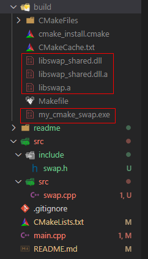

@[toc]

# 一、源码目录结构

创建src目录，在src目录下创建include目录用于存放头文件，创建src目录用于存放源文件。


# 二、修改CMakeLists.txt

```c
cmake_minimum_required(VERSION 3.0)
PROJECT(MYSWAP)

# -g参数会生成调试信息，比如在main中增加了断点，使用-g时会在编译时加入这个断点信息
set(CMAKE_CXX_FLAGS "-g")

# 生成一个静态库，会生成一个libswap.a文件
add_library(swap "${CMAKE_CURRENT_SOURCE_DIR}/src/src/swap.cpp")
# 生成一个共享库，会生成一个libswap_shared.dll文件
add_library(swap_shared SHARED "${CMAKE_CURRENT_SOURCE_DIR}/src/src/swap.cpp")

# 头文件目录
include_directories("${CMAKE_CURRENT_SOURCE_DIR}/src/include")
# 源文件目录
AUX_SOURCE_DIRECTORY("${CMAKE_CURRENT_SOURCE_DIR}/src/src" DIR_SRCS)

# 生成可执行文件，这里没有写swap.cpp,是因为swap.cpp和swap.h编译成了链接库，
# 后面再使用target_link_libraries把库链接到my_cmake_swap
# add_executable(my_cmake_swap main.cpp ${DIR_SRCS})
add_executable(my_cmake_swap main.cpp)

# 把可执行程序链接到共享库（动态链接库）
# target_link_libraries(my_cmake_swap swap_shared)
# 也可以使用下面的，把可执行程序链接到静态库
target_link_libraries(my_cmake_swap swap)
```


# 三、构建编译并调试

如果配置了launch.json和task.json构建cmake和make，则按vscode的F5即可开始进行cmake构建并进入调试。


如果没有配置task.json,则进入build文件夹，执行如下命令构建，但不会进行调试：

```c
cmake ..
make 
```

完成后会在build目录下生成链接库文件和可执行程序：




# 四、源码下载

本例程下载：[https://github.com/TonsenWei/mycmake/archive/V1.0.3.zip](https://github.com/TonsenWei/mycmake/archive/V1.0.3.zip)