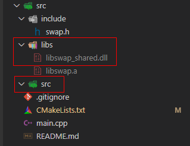
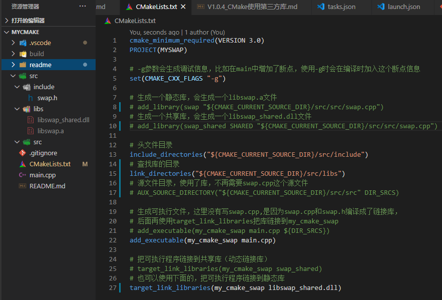
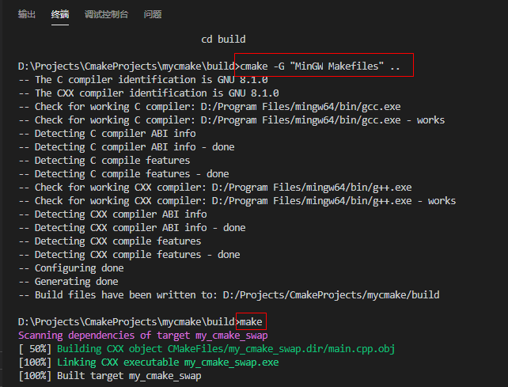
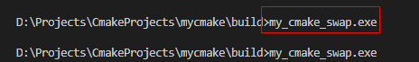
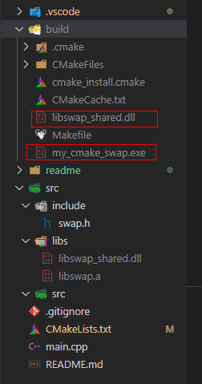
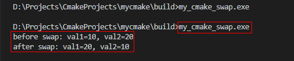

@[toc]

# 一、简介

V1.0.3中介绍了CMake生成链接库的方法，本篇介绍CMake如何使用第三方库。
这里的第三方库使用的是V1.0.3中生成的libswap_shared.dll动态链接库。

为了模拟使用第三方库，这里把swap.cpp删除，然后把libswap_shared.dll放到src/libs文件夹，
再在CMakeLists.txt中引用libswap_shared.dll。引用第三方库的必备条件：

    1、库对应的头文件（这个例子中是swap.h）
    2、库本身（这个例子中是libswap_shared.dll）


# 二、使用步骤

1、删除swap.cpp文件(模拟使用第三方库没有源文件的情况下，使用头文件和dll库进行编译链接)

2、把V1.0.3中生成的libswap_shared.dll库放到src/libs目录下



3、修改CMakeLists.txt，使用link_directories指定查找库的路径，然后使用target_link_libraries链接库文件
```c
cmake_minimum_required(VERSION 3.0)
PROJECT(MYSWAP)

# -g参数会生成调试信息，比如在main中增加了断点，使用-g时会在编译时加入这个断点信息
set(CMAKE_CXX_FLAGS "-g")

# 生成一个静态库，会生成一个libswap.a文件
# add_library(swap "${CMAKE_CURRENT_SOURCE_DIR}/src/src/swap.cpp")
# 生成一个共享库，会生成一个libswap_shared.dll文件
# add_library(swap_shared SHARED "${CMAKE_CURRENT_SOURCE_DIR}/src/src/swap.cpp")

# 头文件目录
include_directories("${CMAKE_CURRENT_SOURCE_DIR}/src/include")
# 查找库的目录
link_directories("${CMAKE_CURRENT_SOURCE_DIR}/src/libs")
# 源文件目录，使用了库，不再需要swap.cpp这个源文件
# AUX_SOURCE_DIRECTORY("${CMAKE_CURRENT_SOURCE_DIR}/src/src" DIR_SRCS)

# 生成可执行文件，这里没有写swap.cpp,是因为swap.cpp和swap.h编译成了链接库，
# 后面再使用target_link_libraries把库链接到my_cmake_swap
# add_executable(my_cmake_swap main.cpp ${DIR_SRCS})
add_executable(my_cmake_swap main.cpp)

# 把可执行程序链接到共享库（动态链接库）
# target_link_libraries(my_cmake_swap swap_shared)
# 也可以使用下面的，把可执行程序链接到静态库
target_link_libraries(my_cmake_swap libswap_shared.dll)
```



4、打开终端，在build目录下，执行如下命令：
    
    cmake -G "MinGW Makefiles" ..
    make



这样就编译生成了exe可执行文件。

5、执行my_cmake_swap.exe,会发现没有输出，这是因为我们没有把动态链接库和exe程序放在同一个目录中，
我们把libswap_shared.dll拷贝放到生成exe程序的build目录下，再执行exe程序发现有输出了。


没有输出：



把libswap_shared.dll拷贝放到生成exe程序的build目录下：


再次执行exe程序有输出：



# 三、总结

使用第三方动态链接库，需要有头文件，库本身，生成可执行文件后，可执行文件需要与库放在同一个目录后即可运行。

待后续学习和验证：
- 1、动态链接库安装到系统某个路径，是否就不再需要可执行文件和库放在同一个路径？
- 2、动态链接库配置为全局变量，是否就不再需要可知文件和库放在同一个路径？
- 3、如果使用静态链接库，生成可执行程序后是否就不再需要该静态链接库？

# 四、源码下载

本例程下载：[https://github.com/TonsenWei/mycmake/archive/V1.0.4.zip](https://github.com/TonsenWei/mycmake/archive/V1.0.4.zip)