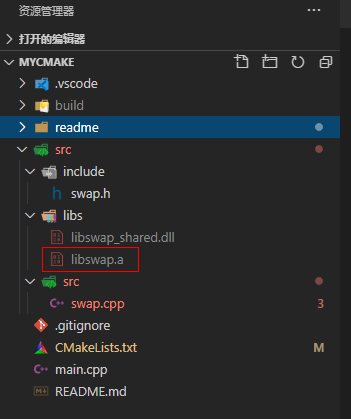
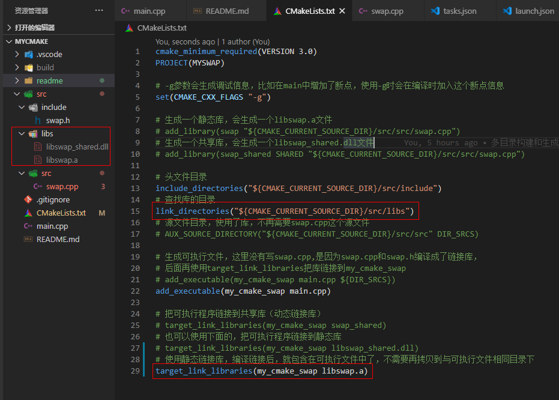
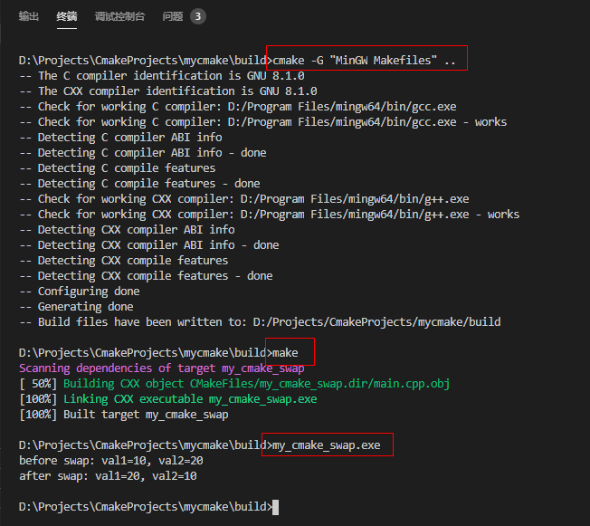

@[toc]

# 一、简介

V1.0.4中介绍了如何使用第三方动态链接库，本篇学习如何使用第三方静态链接库。
这里的第三方库使用的是V1.0.3中生成的libswap.a静态链接库。

为了模拟使用第三方库，可以把swap.cpp删除，然后把libswap.a放到src/libs文件夹，
再在CMakeLists.txt中引用libswap.a。引用第三方库的必备条件：

    1、库对应的头文件（这个例子中是swap.h）
    2、库本身（这个例子中是libswap.a）

# 二、使用步骤

1、删除swap.cpp文件(模拟使用第三方库没有源文件的情况下，使用头文件和dll库进行编译链接)

2、把V1.0.3中生成的libswap.a库放到src/libs目录下



3、修改CMakeLists.txt，使用link_directories指定查找库的路径，然后使用target_link_libraries链接静态库文件
```c
cmake_minimum_required(VERSION 3.0)
PROJECT(MYSWAP)

# -g参数会生成调试信息，比如在main中增加了断点，使用-g时会在编译时加入这个断点信息
set(CMAKE_CXX_FLAGS "-g")

# 头文件目录
include_directories("${CMAKE_CURRENT_SOURCE_DIR}/src/include")
# 查找库的目录
link_directories("${CMAKE_CURRENT_SOURCE_DIR}/src/libs")

# 生成可执行文件，这里没有写swap.cpp,是因为swap.cpp和swap.h编译成了链接库，
# 后面再使用target_link_libraries把库链接到my_cmake_swap
add_executable(my_cmake_swap main.cpp)

# 使用静态链接库，编译链接后，就包含在可执行文件中了，不需要再拷贝到与可执行文件相同目录下
target_link_libraries(my_cmake_swap libswap.a)
```



4、打开终端，在build目录下，执行如下命令：
    
    cmake -G "MinGW Makefiles" ..
    make
    my_cmake_swap.exe




# 三、总结

使用第三方静态链接库与使用动态链接库类似，需要有头文件，库本身，一个最大的区别是，生成可执行文件后，不再需要把库复制到与可执行文件同一个目录了，相当于库本身被编译到可执行文件中了。

待后续学习和验证（先记下，以后再说^_^）：
- 1、动态链接库安装到系统某个路径，是否就不再需要将可执行文件和库放在同一个路径？
- 2、动态链接库配置为全局变量，是否就不再需要可执行文件和库放在同一个路径？

# 四、源码下载

本例程下载：[https://github.com/TonsenWei/mycmake/archive/V1.0.5.zip](https://github.com/TonsenWei/mycmake/archive/V1.0.5.zip)
